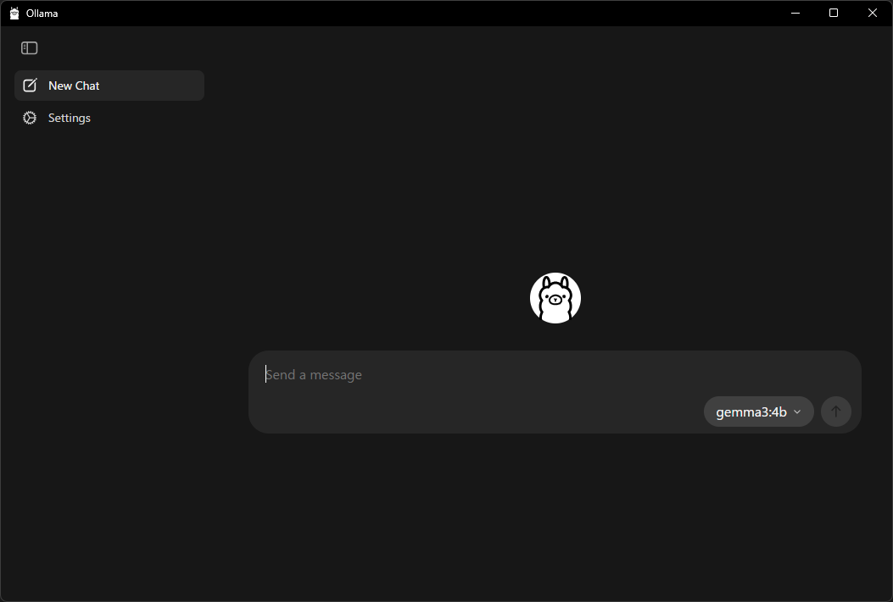
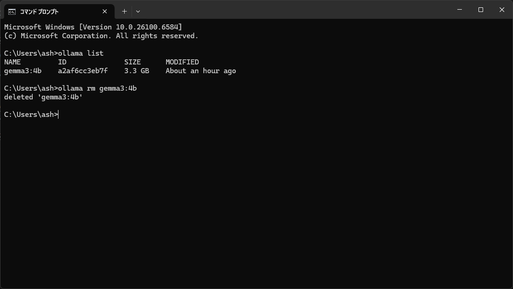
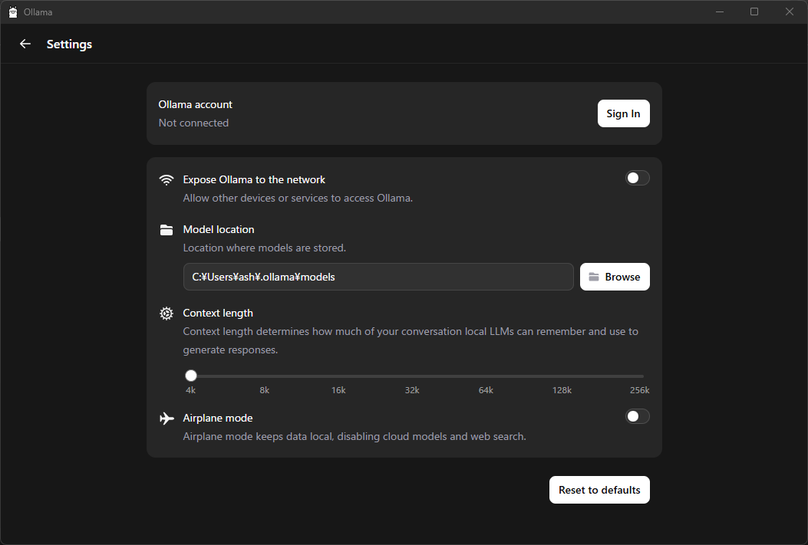

インストールが完了したら、Ollamaという名前のアプリがスタートメニューに登録されるのでダブルクリックして実行できます。<br />
現在は、gemma3:4bというＡＩモデルが選択されている状態です。<br />
このドロップダウンボックスの値を変えることで、ＡＩモデルを変更できます。<br />
また、Settingsをクリックすると、次に移す設定画面に遷移できるようです。<br />



### ドロップダウンリストにないＡＩモデルについて

ドロップダウンについても入力する事で選択できるようになります。


### インストールしたＡＩモデルの削除について

#### 現状、コンソール画面にて、下記のコマンドを実行する事でインストール済みのＡＩモデルの一覧を表示できます。

```
ollama list
```

#### その後、下記のコマンドにて、モデル名を指定して削除する事が可能です。

今回でいうとgemma3:4bがモデル名ですね。

```
ollama rm gemma3:4b
```




## 設定画面

下記の設定画面が現れます。<br />
使い方とかは特に知りませんｗ。


