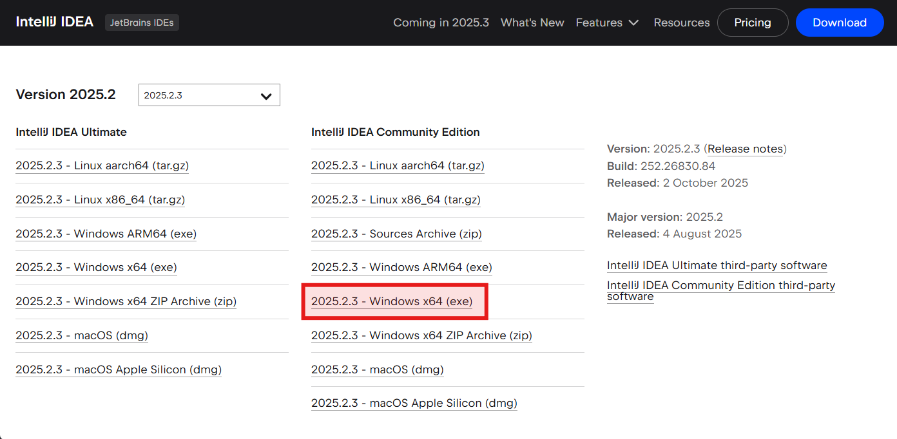
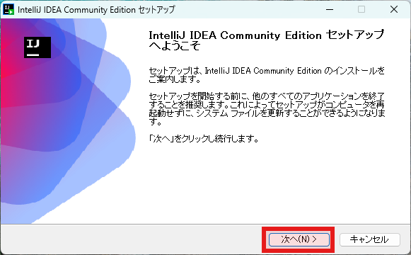
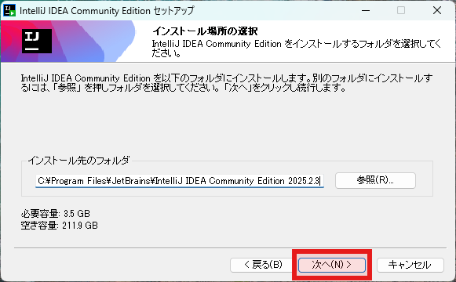
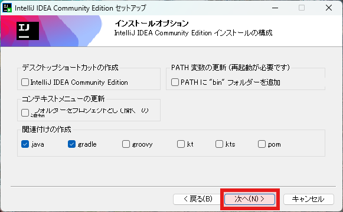
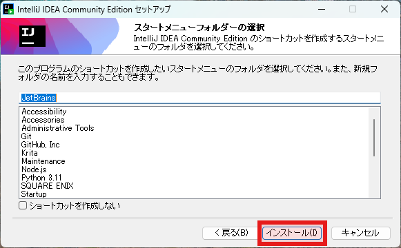
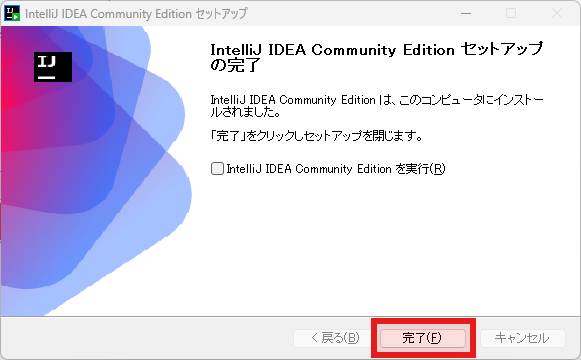

## インストーラのダウンロード

使うエディションとオペレーティングシステム、インストール方法に合わせて適切なファイルをダウントードしてください。

[https://www.jetbrains.com/idea/download/other.html](https://www.jetbrains.com/idea/download/other.html)

ここでは、上記赤枠で囲まれたインストーラを使用する場合を例にインストールなどの手順を説明いたします。

## インストール

### ようこそ

次へをクリックします。

### インストール先を選択

インストール先のフォルダを指定し、次へをクリックします。 
※特に事情がない限り、デフォルトで問題ありません。

### オプション設定

デスクトップにショートカットを作成するか、環境変数「PATH」にbinフォルダを登録するか、コンテキストメニューに追加するか、関連付けの有無などを選択し、次へをクリックします。 
※好みで決めてもらって構いません。

### スタートメニュー

スタートメニューにどう登録するか設定し、インストールをクリックします。 
使ったことないｗ

### 完了

インストールが完了しました。 
そのまま使い始める場合はチャックを入れて、それ以外の場合はそのまま、完了ボタンをクリックします。

## 追記

- Windows版、Mac版を選んだ際には、JetBrainsがカスタマイズしたOpenJDKベースのJDKであるJetBrains Runtimeが同梱される為、特に要件がない場合、それをそのまま開発などに置いて使用できる。
- Mac版の場合、eclipseは既にintel CPUのサポートしている為、事実上、Intellij IDEAの一択になる。
