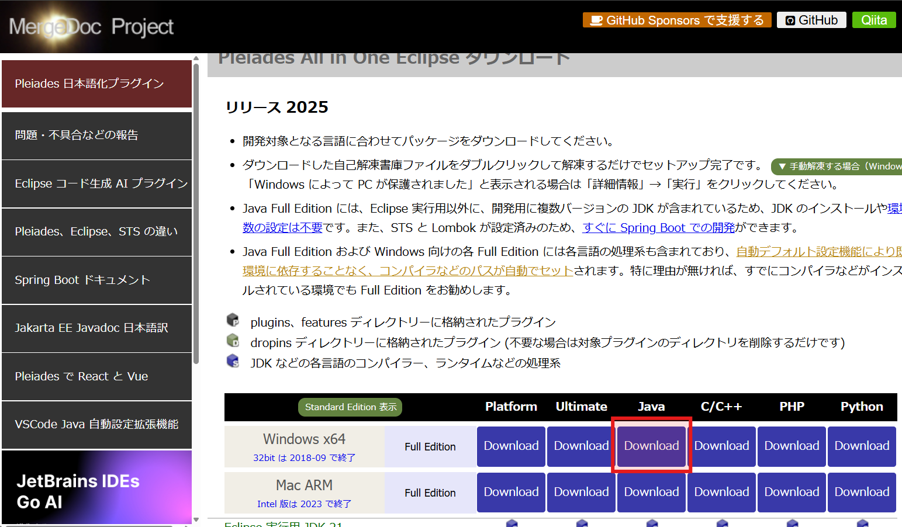
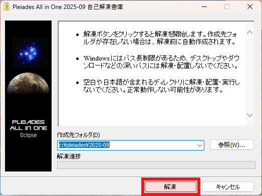

## インストーラのダウンロード

[https://willbrains.jp/index.html#/pleiades_distros2025.html](https://willbrains.jp/index.html#/pleiades_distros2025.html)

未だに雑な印象が拭えないサイトだか…eclipseのインストールは個々から行われることが大半である。
インストーラとは言っても、単に自己解凍形式で圧縮したものであるので、過度な期待は…できないものとなります。

## インストール

解凍先を選択して、解凍をクリックします。
解凍が完了次第、アプリは自動的に終了し、以降何も操作を求められません。

- Intellij IDEAにあったスタートメニューへの登録は対応していません。
- Intellij IDEAにあったファイルの拡張子に関連付けする機能も対応していません。

Full Editionの場合、Adoptiumの OpenJDK ディストリビューションが同梱されています。

## 追記

- Java 8, 11, 17, 21, 25と５種類のJDKが同梱される点は業務利用としては嬉しいポイントになる可能性あり。
- Mac版がアップルシリコン限定とはいえ、そもそもMac版の利用は少ない事が予想され問題にならない可能性が高い。
