## mermaid.jsで記載できる全種類の図形とサンプルをください

mermaid.jsでは、フローチャート、シーケンス図、クラス図、ステート図、ガントチャート、円グラフなど、さまざまな種類の図形を作成できます。

ここでは、mermaid.jsで記述できる主な図形の種類と、それぞれの簡単なサンプルコードをご紹介します。

### 1\. フローチャート (flowchart)

プロセスやタスクの流れを視覚的に表現するのに使われます。

```
graph TD
    A[開始] --> B{判断};
    B -- はい --> C[処理1];
    B -- いいえ --> D[処理2];
    C --> E[終了];
    D --> E;
```

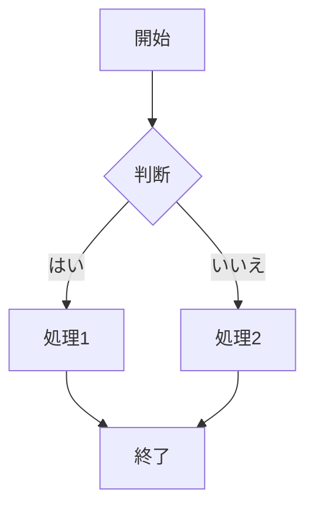
```mermaid
graph TD
    A[開始] --> B{判断};
    B -- はい --> C[処理1];
    B -- いいえ --> D[処理2];
    C --> E[終了];
    D --> E;
```

-----

### 2\. シーケンス図 (sequenceDiagram)

システムやプログラムのコンポーネント間で、メッセージがどのような順序でやりとりされるかを示します。

```
sequenceDiagram
    participant Alice
    participant Bob
    Alice->>Bob: こんにちは
    activate Bob
    Bob-->>Alice: こんにちは、Aliceさん
    deactivate Bob
```

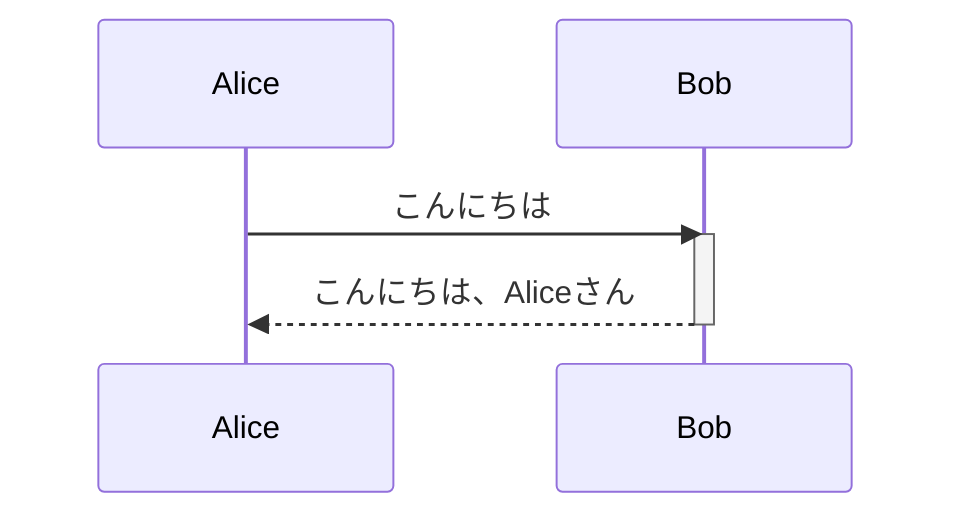
```mermaid
sequenceDiagram
    participant Alice
    participant Bob
    Alice->>Bob: こんにちは
    activate Bob
    Bob-->>Alice: こんにちは、Aliceさん
    deactivate Bob
```

-----

### 3\. クラス図 (classDiagram)

オブジェクト指向プログラミングにおけるクラス、属性、メソッド、およびそれらの関係を図示します。

```
classDiagram
    class Animal{
        +name: String
        +age: int
        +eat()
    }
    class Dog{
        +breed: String
        +bark()
    }
    Animal <|-- Dog
```

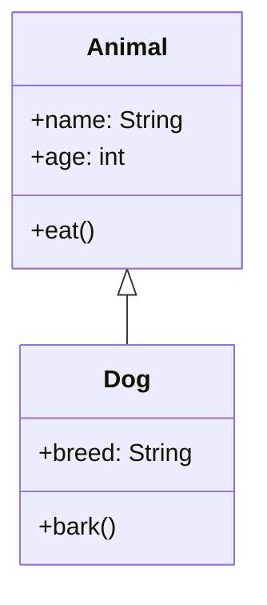
```mermaid
classDiagram
    class Animal{
        +name: String
        +age: int
        +eat()
    }
    class Dog{
        +breed: String
        +bark()
    }
    Animal <|-- Dog
```

-----

### 4\. ステート図 (stateDiagram-v2)

オブジェクトのライフサイクルにおける状態遷移を表現します。

```
stateDiagram-v2
    [*] --> Off
    Off --> On: ボタンを押す
    On --> Off: ボタンをもう一度押す
```

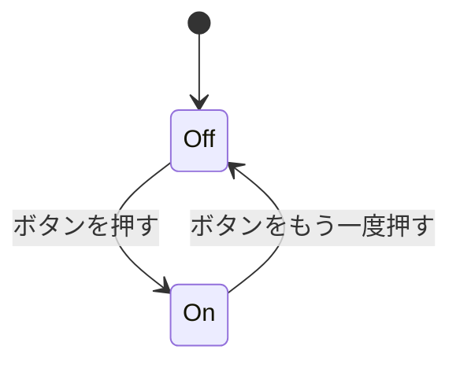
```mermaid
stateDiagram-v2
    [*] --> Off
    Off --> On: ボタンを押す
    On --> Off: ボタンをもう一度押す
```

-----

### 5\. ガントチャート (gantt)

プロジェクトのスケジュール管理に使われ、各タスクの開始日、終了日、期間を視覚的に示します。

```
gantt
    title プロジェクトのタイムライン
    dateFormat  YYYY-MM-DD
    section 開発
    要件定義      :done,    des1, 2024-01-01, 2024-01-10
    設計          :active,  des2, 2024-01-11, 2024-01-20
    実装          :         des3, 2024-01-21, 2024-02-15
```

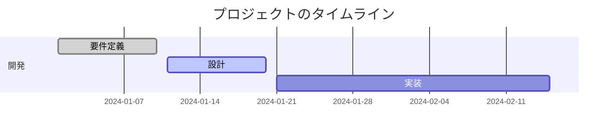
```mermaid
gantt
    title プロジェクトのタイムライン
    dateFormat  YYYY-MM-DD
    section 開発
    要件定義      :done,    des1, 2024-01-01, 2024-01-10
    設計          :active,  des2, 2024-01-11, 2024-01-20
    実装          :         des3, 2024-01-21, 2024-02-15
```

-----

### 6\. 円グラフ (pie)

データの比率を円形で表示します。

```
pie
    title 好きなフルーツ
    "りんご" : 40
    "バナナ" : 30
    "オレンジ" : 20
    "その他" : 10
```

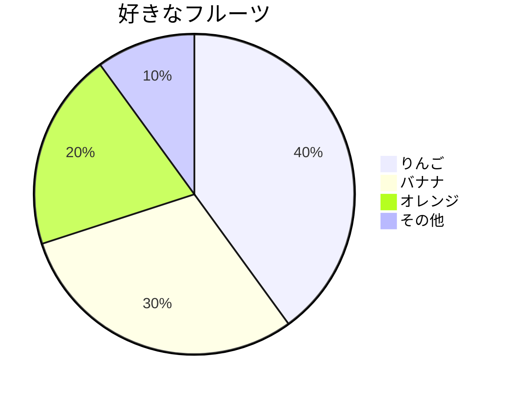
```mermaid
pie
    title 好きなフルーツ
    "りんご" : 40
    "バナナ" : 30
    "オレンジ" : 20
    "その他" : 10
```

-----

### 7\. ユーザー旅程図 (journey)

ユーザーがサービスや製品を利用する際の、一連の行動や感情の変化を視覚化します。

```
journey
    title My working day
    section Go to work
      Make tea: 5: Me
      Go upstairs: 3: Me
      Do work: 1: Me, Cat
    section Go home
      Go downstairs: 5: Me
      Sit down: 5: Me
```

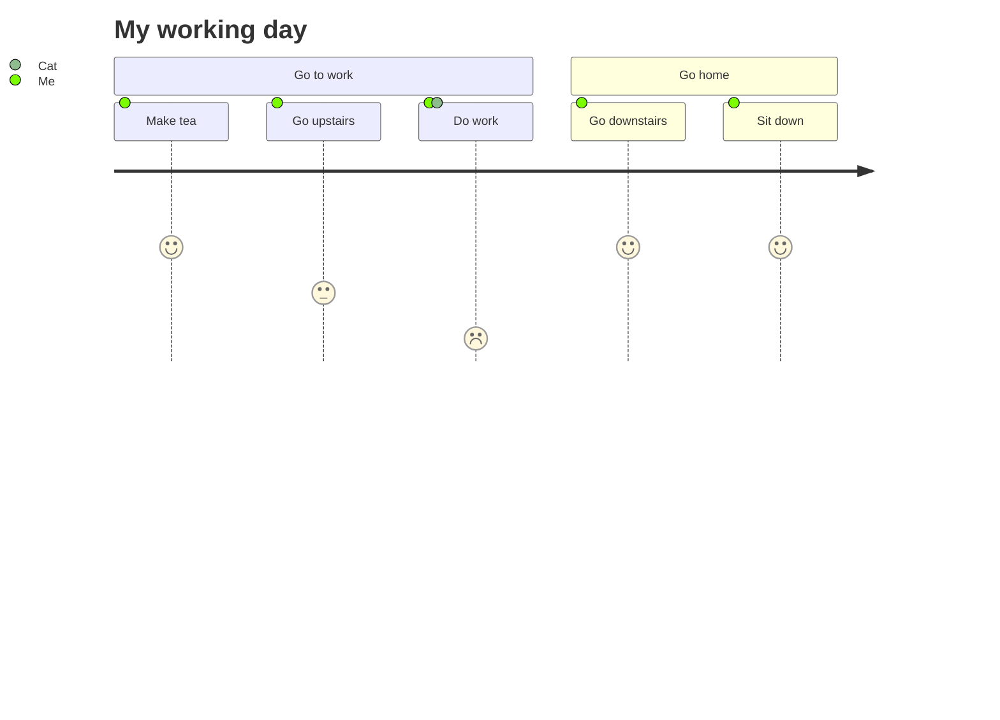
```mermaid
journey
    title My working day
    section Go to work
      Make tea: 5: Me
      Go upstairs: 3: Me
      Do work: 1: Me, Cat
    section Go home
      Go downstairs: 5: Me
      Sit down: 5: Me
```

-----

### 8\. ER図 (erDiagram)

データベースのエンティティ（実体）、属性、およびそれらの関係を図示します。

```
erDiagram
    CUSTOMER ||--o{ ORDER : has
    ORDER ||--|{ LINE-ITEM : contains
    CUSTOMER {
        string name
        string email
    }
    ORDER {
        int orderNumber
        string shippingAddress
    }
    LINE-ITEM {
        string productCode
        int quantity
    }
```

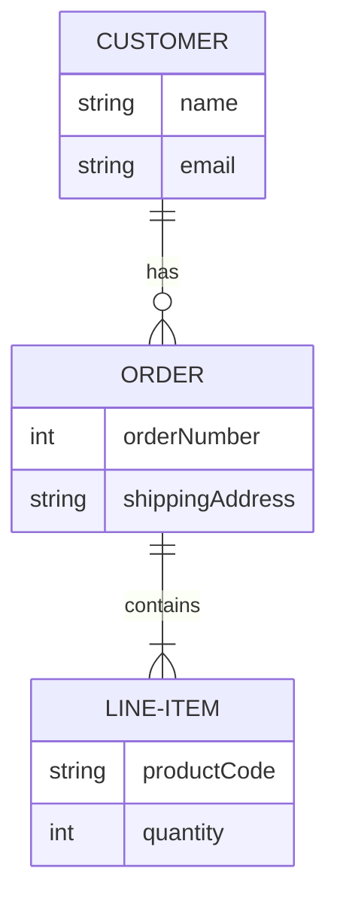
```mermaid
erDiagram
    CUSTOMER ||--o{ ORDER : has
    ORDER ||--|{ LINE-ITEM : contains
    CUSTOMER {
        string name
        string email
    }
    ORDER {
        int orderNumber
        string shippingAddress
    }
    LINE-ITEM {
        string productCode
        int quantity
    }
```

-----

### 9\. gitグラフ (gitGraph)

Gitのブランチ、コミット、マージなどの操作を視覚的に表現します。

```
gitGraph
    commit
    commit
    branch develop
    checkout develop
    commit
    commit
    checkout main
    merge develop
    commit
```

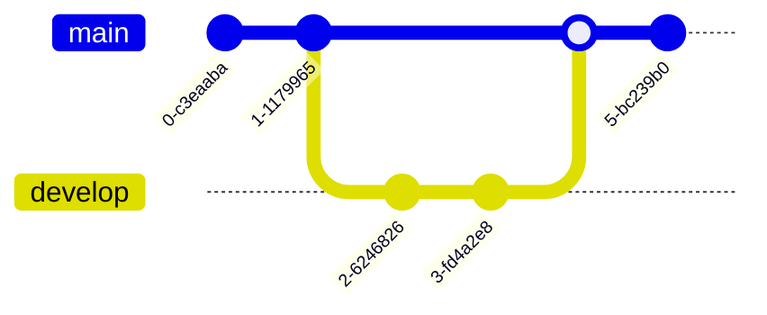
```mermaid
gitGraph
    commit
    commit
    branch develop
    checkout develop
    commit
    commit
    checkout main
    merge develop
    commit
```

-----

### 10\. マインドマップ (mindmap)

アイデアや概念の階層的な関連性を表現します。

```
mindmap
  root((Mermaid マインドマップ))
    (トピック1)
      - サブトピック1-1
      - サブトピック1-2
        ((サブトピック1-2-1))
    [トピック2]
      - サブトピック2-1
      - サブトピック2-2
    ))トピック3((
      - サブトピック3-1
      - サブトピック3-2
```

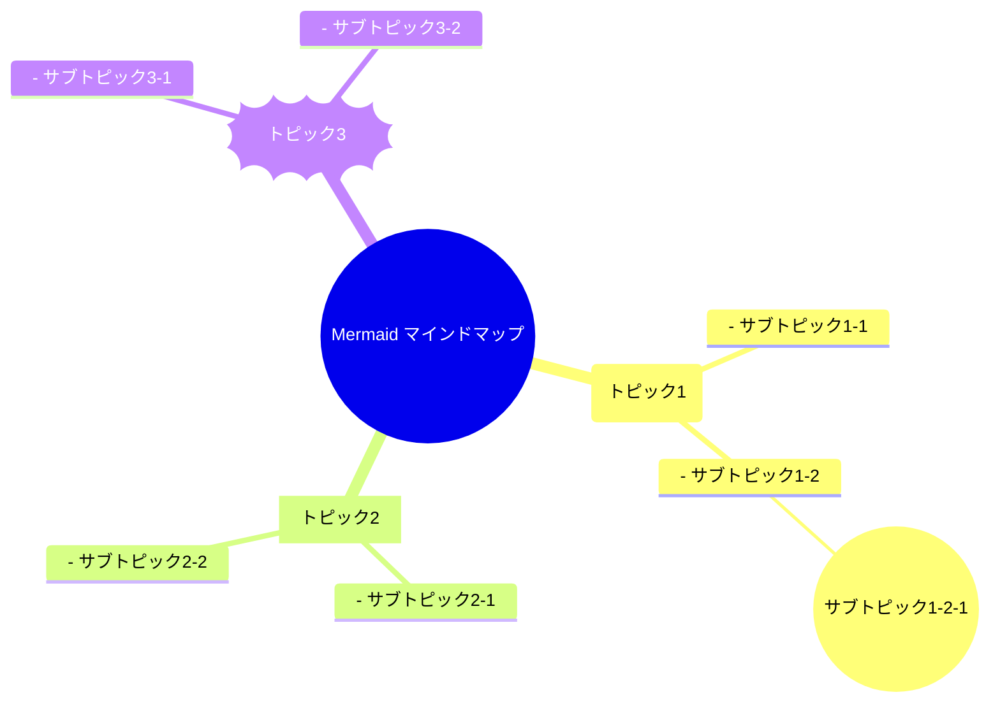
```mermaid
mindmap
  root((Mermaid マインドマップ))
    (トピック1)
      - サブトピック1-1
      - サブトピック1-2
        ((サブトピック1-2-1))
    [トピック2]
      - サブトピック2-1
      - サブトピック2-2
    ))トピック3((
      - サブトピック3-1
      - サブトピック3-2
```

-----

### 11\. パケット図 (packet)

ネットワークパケットの構造を視覚的に表現します。

```
---
title: "TCP Packet"
---
packet
0-15: "Source Port"
16-31: "Destination Port"
32-63: "Sequence Number"
64-95: "Acknowledgment Number"
96-99: "Data Offset"
100-105: "Reserved"
106: "URG"
107: "ACK"
108: "PSH"
109: "RST"
110: "SYN"
111: "FIN"
112-127: "Window"
128-143: "Checksum"
144-159: "Urgent Pointer"
160-191: "(Options and Padding)"
192-255: "Data (variable length)"
```

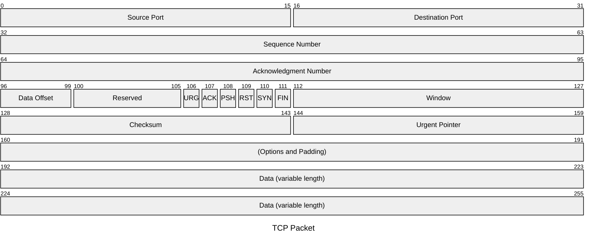
```mermaid
---
title: "TCP Packet"
---
packet
0-15: "Source Port"
16-31: "Destination Port"
32-63: "Sequence Number"
64-95: "Acknowledgment Number"
96-99: "Data Offset"
100-105: "Reserved"
106: "URG"
107: "ACK"
108: "PSH"
109: "RST"
110: "SYN"
111: "FIN"
112-127: "Window"
128-143: "Checksum"
144-159: "Urgent Pointer"
160-191: "(Options and Padding)"
192-255: "Data (variable length)"
```

-----

### 12\. タイムライン (Timeline)

イベントの時系列を表現します。

```
timeline
    title 主要イベント
    section 2024年
        イベントA : 2024-01
        イベントB : 2024-03
    section 2025年
        イベントC : 2025-05
```

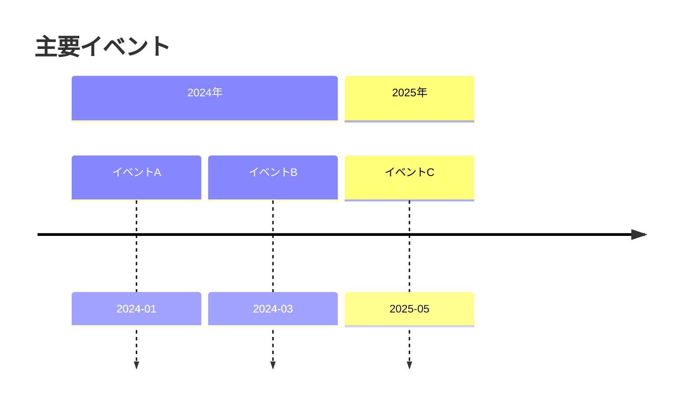
```mermaid
timeline
    title 主要イベント
    section 2024年
        イベントA : 2024-01
        イベントB : 2024-03
    section 2025年
        イベントC : 2025-05
```

-----

### 13\. かんばん図 (kanban)

かんばん図は、タスクの進捗状況を「Todo」「進行中」「完了」といった列で視覚化するのに使います。

```
---
config:
  kanban:
    ticketBaseUrl: 'https://github.com/mermaid-js/mermaid/issues/#TICKET#'
---
kanban
  Todo
    [Create Documentation]
    docs[Create Blog about the new diagram]
  [In progress]
    id6[Create renderer so that it works in all cases. We also add some extra text here for testing purposes. And some more just for the extra flare.]
  id9[Ready for deploy]
    id8[Design grammar]@{ assigned: 'knsv' }
  id10[Ready for test]
    id4[Create parsing tests]@{ ticket: 2038, assigned: 'K.Sveidqvist', priority: 'High' }
    id66[last item]@{ priority: 'Very Low', assigned: 'knsv' }
  id11[Done]
    id5[define getData]
    id2[Title of diagram is more than 100 chars when user duplicates diagram with 100 char]@{ ticket: 2036, priority: 'Very High'}
    id3[Update DB function]@{ ticket: 2037, assigned: knsv, priority: 'High' }

  id12[Can't reproduce]
    id3[Weird flickering in Firefox]
```

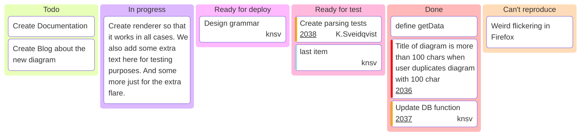
```mermaid
---
config:
  kanban:
    ticketBaseUrl: 'https://github.com/mermaid-js/mermaid/issues/#TICKET#'
---
kanban
  Todo
    [Create Documentation]
    docs[Create Blog about the new diagram]
  [In progress]
    id6[Create renderer so that it works in all cases. We also add some extra text here for testing purposes. And some more just for the extra flare.]
  id9[Ready for deploy]
    id8[Design grammar]@{ assigned: 'knsv' }
  id10[Ready for test]
    id4[Create parsing tests]@{ ticket: 2038, assigned: 'K.Sveidqvist', priority: 'High' }
    id66[last item]@{ priority: 'Very Low', assigned: 'knsv' }
  id11[Done]
    id5[define getData]
    id2[Title of diagram is more than 100 chars when user duplicates diagram with 100 char]@{ ticket: 2036, priority: 'Very High'}
    id3[Update DB function]@{ ticket: 2037, assigned: knsv, priority: 'High' }

  id12[Can't reproduce]
    id3[Weird flickering in Firefox]
```

-----

### 14\. ブロック図 (block-beta)

システムの構成要素（ブロック）とその接続を表現します。

```
block-beta
columns 1
  db(("DB"))
  blockArrowId6<["&nbsp;&nbsp;&nbsp;"]>(down)
  block:ID
    A
    B["A wide one in the middle"]
    C
  end
  space
  D
  ID --> D
  C --> D
  style B fill:#969,stroke:#333,stroke-width:4px
```

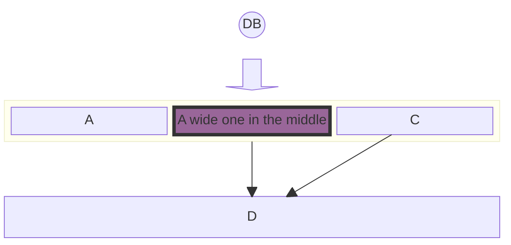
```mermaid
block-beta
columns 1
  db(("DB"))
  blockArrowId6<["&nbsp;&nbsp;&nbsp;"]>(down)
  block:ID
    A
    B["A wide one in the middle"]
    C
  end
  space
  D
  ID --> D
  C --> D
  style B fill:#969,stroke:#333,stroke-width:4px
```

-----

### 15\. C4モデル (C4-Model)

ソフトウェアシステムの構造を階層的に表現します。

```
C4Context
    title System Context diagram for Internet Banking System
    Enterprise_Boundary(b0, "BankBoundary0") {
        Person(customerA, "Banking Customer A", "A customer of the bank, with personal bank accounts.")
        Person(customerB, "Banking Customer B")
        Person_Ext(customerC, "Banking Customer C", "desc")

        Person(customerD, "Banking Customer D", "A customer of the bank, <br/> with personal bank accounts.")

        System(SystemAA, "Internet Banking System", "Allows customers to view information about their bank accounts, and make payments.")

        Enterprise_Boundary(b1, "BankBoundary") {
            SystemDb_Ext(SystemE, "Mainframe Banking System", "Stores all of the core banking information about customers, accounts, transactions, etc.")

            System_Boundary(b2, "BankBoundary2") {
                System(SystemA, "Banking System A")
                System(SystemB, "Banking System B", "A system of the bank, with personal bank accounts. next line.")
            }

            System_Ext(SystemC, "E-mail system", "The internal Microsoft Exchange e-mail system.")
            SystemDb(SystemD, "Banking System D Database", "A system of the bank, with personal bank accounts.")

            Boundary(b3, "BankBoundary3", "boundary") {
                SystemQueue(SystemF, "Banking System F Queue", "A system of the bank.")
                SystemQueue_Ext(SystemG, "Banking System G Queue", "A system of the bank, with personal bank accounts.")
            }
        }
    }

    BiRel(customerA, SystemAA, "Uses")
    BiRel(SystemAA, SystemE, "Uses")
    Rel(SystemAA, SystemC, "Sends e-mails", "SMTP")
    Rel(SystemC, customerA, "Sends e-mails to")
```

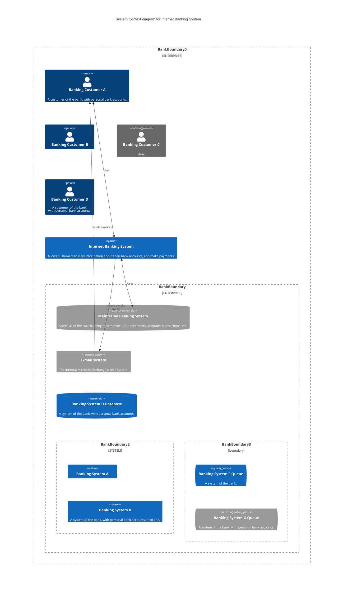
```mermaid
C4Context
    title System Context diagram for Internet Banking System
    Enterprise_Boundary(b0, "BankBoundary0") {
        Person(customerA, "Banking Customer A", "A customer of the bank, with personal bank accounts.")
        Person(customerB, "Banking Customer B")
        Person_Ext(customerC, "Banking Customer C", "desc")

        Person(customerD, "Banking Customer D", "A customer of the bank, <br/> with personal bank accounts.")

        System(SystemAA, "Internet Banking System", "Allows customers to view information about their bank accounts, and make payments.")

        Enterprise_Boundary(b1, "BankBoundary") {
            SystemDb_Ext(SystemE, "Mainframe Banking System", "Stores all of the core banking information about customers, accounts, transactions, etc.")

            System_Boundary(b2, "BankBoundary2") {
                System(SystemA, "Banking System A")
                System(SystemB, "Banking System B", "A system of the bank, with personal bank accounts. next line.")
            }

            System_Ext(SystemC, "E-mail system", "The internal Microsoft Exchange e-mail system.")
            SystemDb(SystemD, "Banking System D Database", "A system of the bank, with personal bank accounts.")

            Boundary(b3, "BankBoundary3", "boundary") {
                SystemQueue(SystemF, "Banking System F Queue", "A system of the bank.")
                SystemQueue_Ext(SystemG, "Banking System G Queue", "A system of the bank, with personal bank accounts.")
            }
        }
    }

    BiRel(customerA, SystemAA, "Uses")
    BiRel(SystemAA, SystemE, "Uses")
    Rel(SystemAA, SystemC, "Sends e-mails", "SMTP")
    Rel(SystemC, customerA, "Sends e-mails to")
```

### 16\. クワドラントチャート (Quadrant Chart)

2つの軸でデータを4つの象限に分類して表現します。

```
quadrantChart
    title Reach and engagement of campaigns
    x-axis Low Reach --> High Reach
    y-axis Low Engagement --> High Engagement
    quadrant-1 We should expand
    quadrant-2 Need to promote
    quadrant-3 Re-evaluate
    quadrant-4 May be improved
    Campaign A: [0.3, 0.6]
    Campaign B: [0.45, 0.23]
    Campaign C: [0.57, 0.69]
    Campaign D: [0.78, 0.34]
    Campaign E: [0.40, 0.34]
    Campaign F: [0.35, 0.78]
```

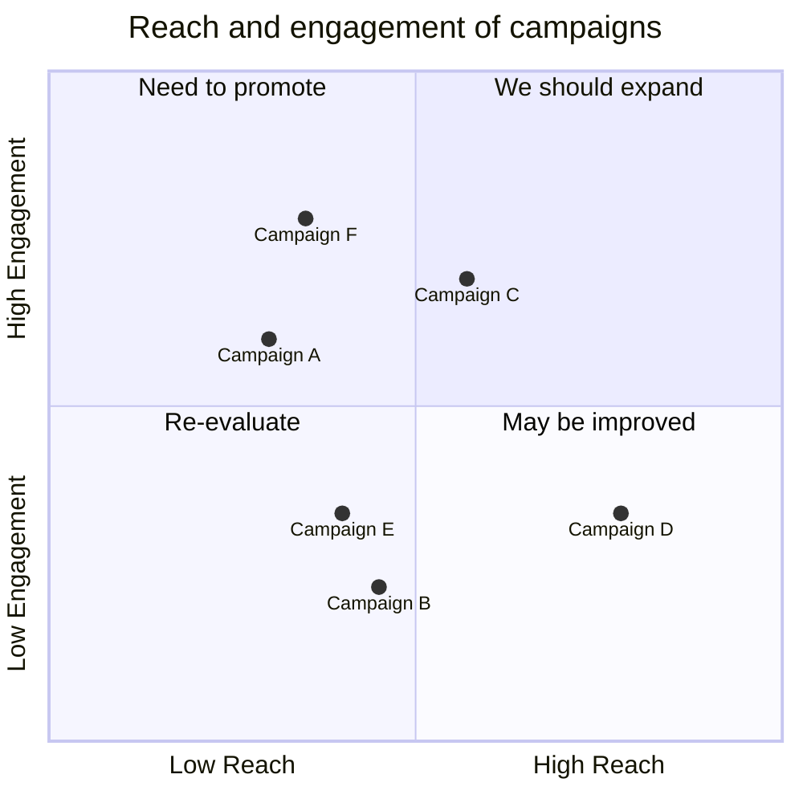
```mermaid
quadrantChart
    title Reach and engagement of campaigns
    x-axis Low Reach --> High Reach
    y-axis Low Engagement --> High Engagement
    quadrant-1 We should expand
    quadrant-2 Need to promote
    quadrant-3 Re-evaluate
    quadrant-4 May be improved
    Campaign A: [0.3, 0.6]
    Campaign B: [0.45, 0.23]
    Campaign C: [0.57, 0.69]
    Campaign D: [0.78, 0.34]
    Campaign E: [0.40, 0.34]
    Campaign F: [0.35, 0.78]
```

### 17\.アーキテクチャ図 (Architecture)

アーキテクチャ図は、ソフトウェアシステムの構造や構成要素、それらの関係性を可視化する図です。

```
architecture-beta
    group api(cloud)[API]

    service db(database)[Database] in api
    service disk1(disk)[Storage] in api
    service disk2(disk)[Storage] in api
    service server(server)[Server] in api

    db:L -- R:server
    disk1:T -- B:server
    disk2:T -- B:db
```

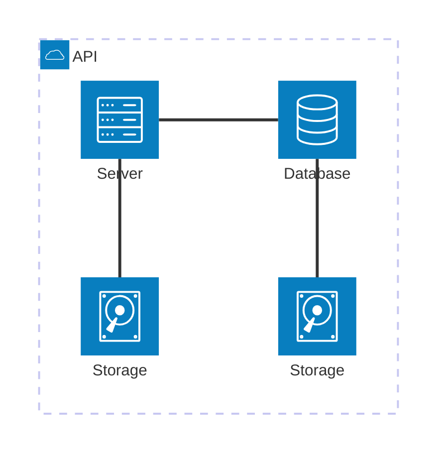
```mermaid
architecture-beta
    group api(cloud)[API]

    service db(database)[Database] in api
    service disk1(disk)[Storage] in api
    service disk2(disk)[Storage] in api
    service server(server)[Server] in api

    db:L -- R:server
    disk1:T -- B:server
    disk2:T -- B:db
```

-----

### 18\.レーダーチャート (Radar)

レーダーチャートは、複数の項目を比較して評価するのに適した図です。

```
---
title: "Grades"
---
radar-beta
  axis m["Math"], s["Science"], e["English"]
  axis h["History"], g["Geography"], a["Art"]
  curve a["Alice"]{85, 90, 80, 70, 75, 90}
  curve b["Bob"]{70, 75, 85, 80, 90, 85}

  max 100
  min 0
```

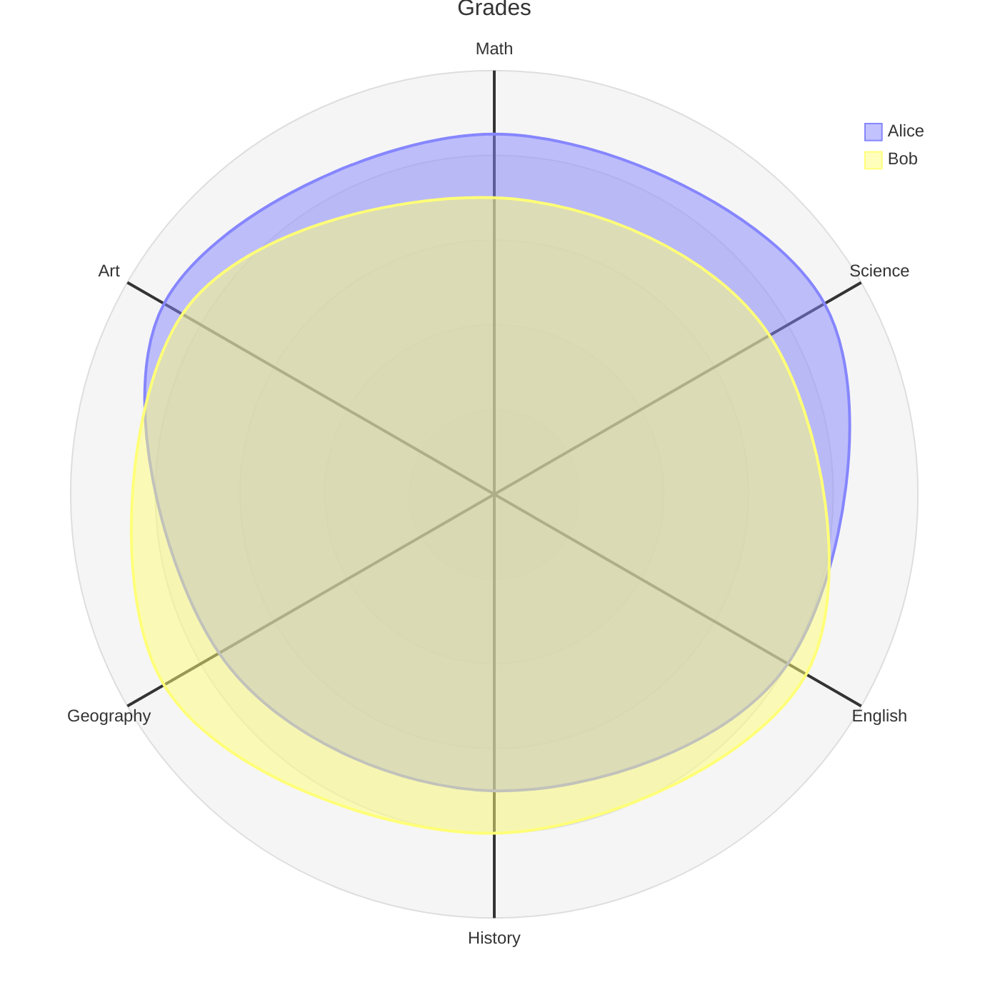
```mermaid
---
title: "Grades"
---
radar-beta
  axis m["Math"], s["Science"], e["English"]
  axis h["History"], g["Geography"], a["Art"]
  curve a["Alice"]{85, 90, 80, 70, 75, 90}
  curve b["Bob"]{70, 75, 85, 80, 90, 85}

  max 100
  min 0
```

-----

### 19\.要件図 (Requirement)

要件図は、システムやソフトウェアの要件を階層的に整理・可視化する図です。

```
requirementDiagram

    requirement test_req {
    id: 1
    text: the test text.
    risk: high
    verifymethod: test
    }

    element test_entity {
    type: simulation
    }

    test_entity - satisfies -> test_req
```

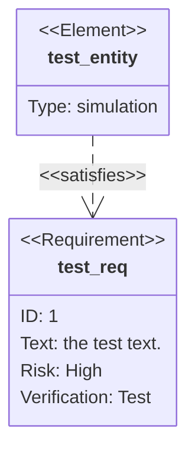
```mermaid
requirementDiagram

    requirement test_req {
    id: 1
    text: the test text.
    risk: high
    verifymethod: test
    }

    element test_entity {
    type: simulation
    }

    test_entity - satisfies -> test_req
```

-----

### 20\.サンキー図 (Sankey)

サンキーダイアグラムは、エネルギーや資源、資金などの流れの量を可視化するのに特化した図です。

```
---
config:
  sankey:
    showValues: false
---
sankey-beta

Agricultural 'waste',Bio-conversion,124.729
Bio-conversion,Liquid,0.597
Bio-conversion,Losses,26.862
Bio-conversion,Solid,280.322
Bio-conversion,Gas,81.144
Biofuel imports,Liquid,35
Biomass imports,Solid,35
Coal imports,Coal,11.606
Coal reserves,Coal,63.965
Coal,Solid,75.571
District heating,Industry,10.639
District heating,Heating and cooling - commercial,22.505
```

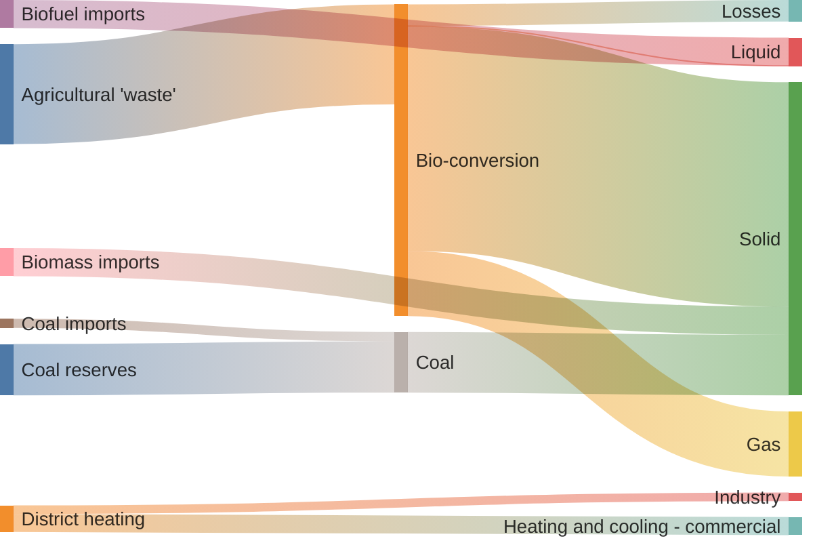
```mermaid
---
config:
  sankey:
    showValues: false
---
sankey-beta

Agricultural 'waste',Bio-conversion,124.729
Bio-conversion,Liquid,0.597
Bio-conversion,Losses,26.862
Bio-conversion,Solid,280.322
Bio-conversion,Gas,81.144
Biofuel imports,Liquid,35
Biomass imports,Solid,35
Coal imports,Coal,11.606
Coal reserves,Coal,63.965
Coal,Solid,75.571
District heating,Industry,10.639
District heating,Heating and cooling - commercial,22.505
```

-----

### 21\.ツリーマップ (Treemap)

ツリーマップは、階層的なデータを長方形の入れ子構造で表現する図です。

```
treemap-beta
"Section 1"
    "Leaf 1.1": 12
    "Section 1.2"
      "Leaf 1.2.1": 12
"Section 2"
    "Leaf 2.1": 20
    "Leaf 2.2": 25
```

```mermaid
treemap-beta
"Section 1"
    "Leaf 1.1": 12
    "Section 1.2"
      "Leaf 1.2.1": 12
"Section 2"
    "Leaf 2.1": 20
    "Leaf 2.2": 25
```

-----

### 22\.散布図 (XY)

XYプロット（散布図）は、2つの変数間の関係性を可視化する図です。

```
xychart-beta
    title "Sales Revenue"
    x-axis [jan, feb, mar, apr, may, jun, jul, aug, sep, oct, nov, dec]
    y-axis "Revenue (in $)" 4000 --> 11000
    bar [5000, 6000, 7500, 8200, 9500, 10500, 11000, 10200, 9200, 8500, 7000, 6000]
    line [5000, 6000, 7500, 8200, 9500, 10500, 11000, 10200, 9200, 8500, 7000, 6000]
```

```mermaid
xychart-beta
    title "Sales Revenue"
    x-axis [jan, feb, mar, apr, may, jun, jul, aug, sep, oct, nov, dec]
    y-axis "Revenue (in $)" 4000 --> 11000
    bar [5000, 6000, 7500, 8200, 9500, 10500, 11000, 10200, 9200, 8500, 7000, 6000]
    line [5000, 6000, 7500, 8200, 9500, 10500, 11000, 10200, 9200, 8500, 7000, 6000]
```

-----

### 23\.ZenUML図 (ZenUML)

ZenUML図は、UML（統一モデリング言語）のシーケンス図を、よりシンプルで直感的な構文で表現するための図です。
:::warning

理由は不明だが動作しない。

:::

-----

これらのサンプルを参考に、目的に応じてさまざまな図形を作成してみてください。
