(Class Diagram)

## サンプル

```
classDiagram
    class Animal{
        +name: String
        +age: int
        +eat()
    }
    class Dog{
        +breed: String
        +bark()
    }
    Animal <|-- Dog
```

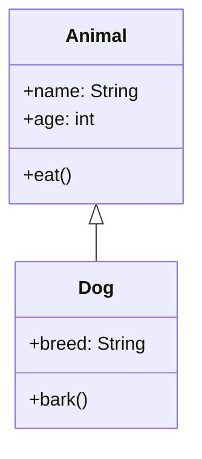

## クラス

クラスを定義できます。

```
class Sample
```

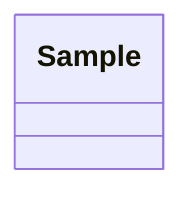

## インターフェイス

```
class Sample {
    <<Interface>>
}
```

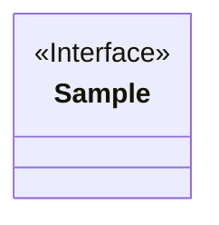

## 抽象クラス

```
class Sample {
    <<abstract>>
}
```

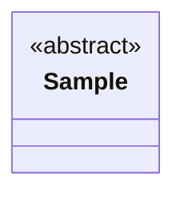

## パッケージ

:::danger
mermaid.jsではパッケージはサポートされません。
:::

### パッケージの中にクラス、インターフェース、抽象クラスを定義

:::danger
mermaid.jsではパッケージはサポートされません。
:::

## フィールド
```
fieldA : int
```

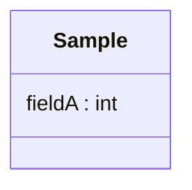

## メソッド

```
methodA() : void
```

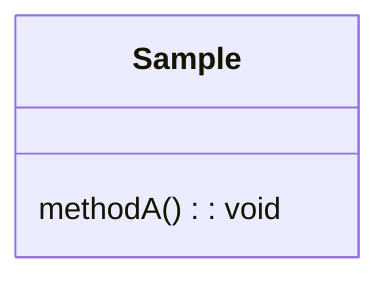

## 可視性

これはjavaの可視性を強く感じる要素かもしれません...。

### private

```
-fieldA : int
-methodA() : void
```

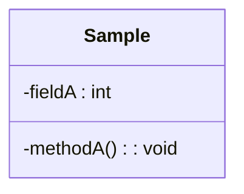

### protected

```
#fieldA : int
#methodA() : void
```

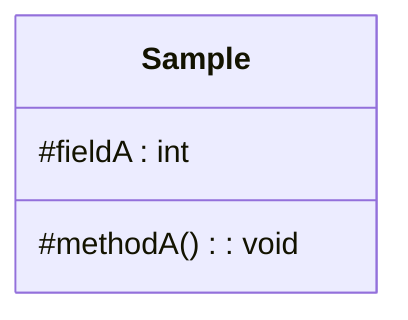

### package private

```
~fieldA : int
~methodA() : void
```

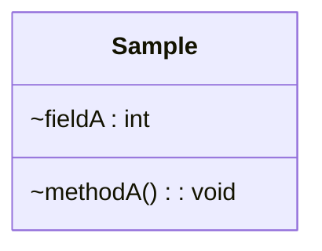

### public

```
+fieldA : int
+methodA() : void
```

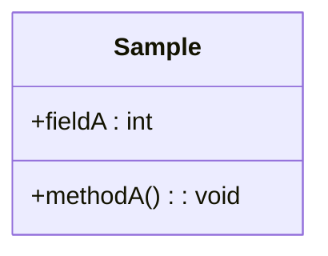

## static

```
fieldA : int$
methodA() : void$
```

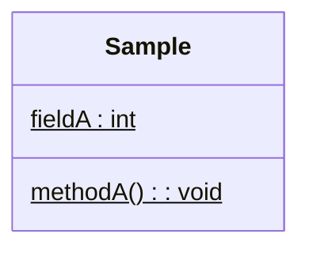

## abstract

:::danger
mermaid.jsではabstractはサポートされません。
:::

## ステレオタイプ

```
class Sample {
    <<ステレオタイプ>>
}
```

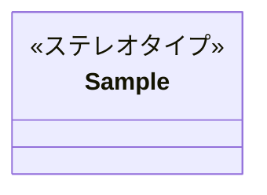

## クラス間などの関係

### 継承

```
ClassA <|-- ClassB
```

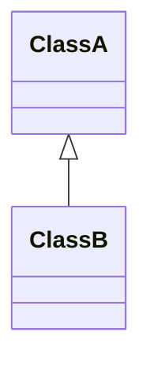

### 実装

```
InterfaceA <.. ClassA
```

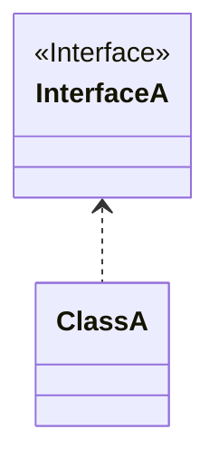

### 内部クラス

:::danger
mermaid.jsでは内部クラスはサポートされません。
:::

### 依存

```
ClassA <|-- ClassB
```


### 集約

子が親から独立して存在できる関係を表しそうですが…。<br />
あまり使わない要素かもしれませんｗ

```
ClassA *-- ClassB
```

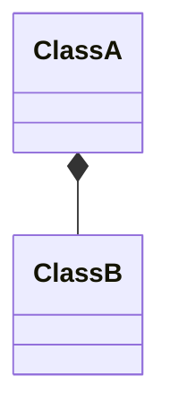

### 構成

子が親から独立して存在できない関係を表すそうですが…。<br />
あまり使わない要素かもしれませんｗ

```
ClassA o-- ClassB
```

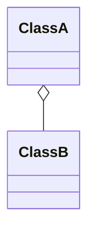

### リンク(実線)

```
ClassA -- ClassB
```

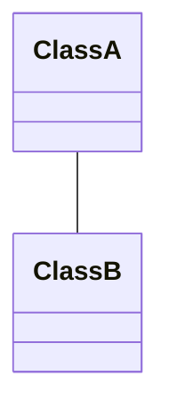

### リンク(点線)

```
ClassA .. ClassB
```

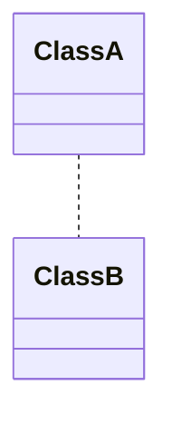

### ラベル

ラベルはリンク（実践）以外でも定義できますが、ここでは代表としてリンクにラベルを付ける形で記載しています。

```
ClassA -- ClassB : ラベル
```

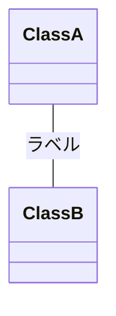

#### ラベルに矢印の追加

:::danger
mermaid.jsではラベルに矢印の追加はサポートされません。
:::

### 多重度

多重度はリンク（実践）以外でも定義できますが、ここでは代表としてリンクにラベルを付ける形で記載しています。

:::warning
一応、動作はするものの期待通りとは・・・
:::

```
ClassA "1..*" -- "*" ClassB
```

```mermaid
classDiagram
    class ClassA {
    }
    class ClassB {
    }
    ClassA "1..*" -- "*" ClassB
```

## ノート

:::danger
mermaid.jsではノートはサポートされません。
:::

## 全体の設定

### タイトル

タイトルを定義できます。

:::warning
定義はできるけどタイトル表示されない
:::

```
title 新基盤構築計画
```

```mermaid
classDiagram
    title 新基盤構築計画
    class Animal{
        +name: String
        +age: int
        +eat()
    }
    class Dog{
        +breed: String
        +bark()
    }
    Animal <|-- Dog
```

### ヘッダ

ヘッダを定義できます。

:::warning
定義はできるけどヘッダ表示されない
:::

```
header 新基盤構築計画
```

```mermaid
classDiagram
    header 新基盤構築計画
    class Animal{
        +name: String
        +age: int
        +eat()
    }
    class Dog{
        +breed: String
        +bark()
    }
    Animal <|-- Dog
```

### フッタ

フッタを定義できます。

:::warning
定義はできるけどフッタ表示されない
:::

```
footer フッタ
```

```mermaid
classDiagram
    footer フッタ
    class Animal{
        +name: String
        +age: int
        +eat()
    }
    class Dog{
        +breed: String
        +bark()
    }
    Animal <|-- Dog
```

### キャプション

キャプションを定義できます。

```
caption キャプション
```

```mermaid
classDiagram
    caption キャプション
    class Animal{
        +name: String
        +age: int
        +eat()
    }
    class Dog{
        +breed: String
        +bark()
    }
    Animal <|-- Dog
```

## 行コメント

`%% `から始まる行は行コメントとして扱われます。


## ブロックコメント

`%%{ `から`%%}`まではブロックコメントとして扱われます。

## 参照

[https://zenn.dev/tak_uchida/articles/da583cf960e854](https://zenn.dev/tak_uchida/articles/da583cf960e854)
