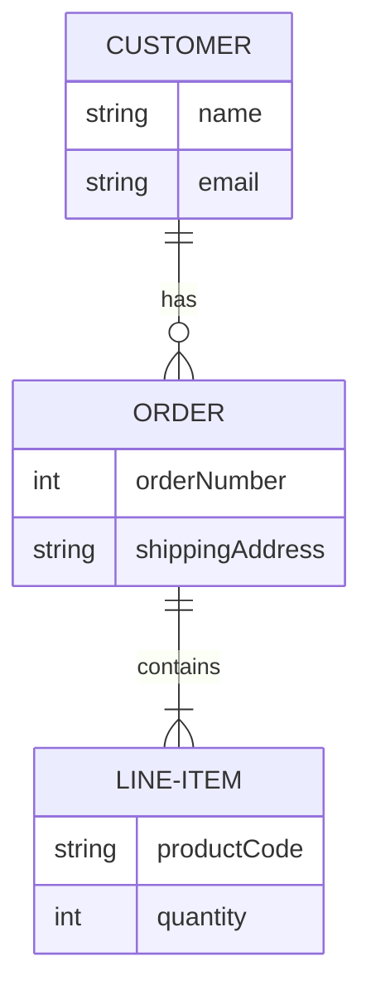
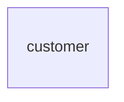
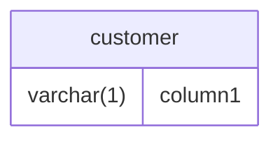
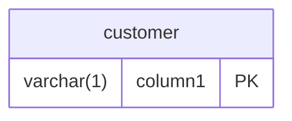
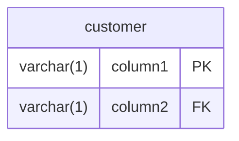
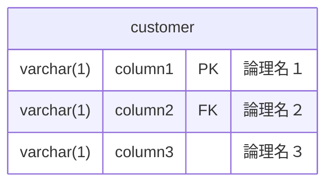
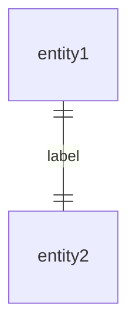
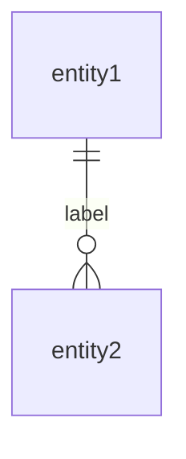
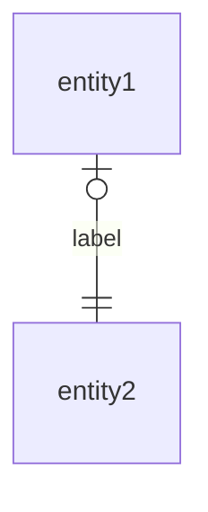

(Entity-Relationship Diagram)

## サンプル

```
erDiagram
    CUSTOMER ||--o{ ORDER : has
    ORDER ||--|{ LINE-ITEM : contains
    CUSTOMER {
        string name
        string email
    }
    ORDER {
        int orderNumber
        string shippingAddress
    }
    LINE-ITEM {
        string productCode
        int quantity
    }
```



## 全体の設定

### タイトル

:::danger
mermaid.jsではタイトルはサポートされません。
:::

### ヘッダ

:::danger
mermaid.jsではタイトルはサポートされません。
:::

### フッタ

:::danger
mermaid.jsではタイトルはサポートされません。
:::

### キャプション

:::danger
mermaid.jsではキャプションはサポートされません。
:::

## エンティティ

エンティティを定義できます。

```
customer {}
```



## カラム

entity要素の中にカラムを定義できます。<br />
※型名の定義が必須になってるみたいですね。

```
customer {
    varchar(1) column1
}
```



### プライマリキー

```
varchar(1) column1 PK
```



### フォーリンキー

```
varchar(1) column2 FK
```



### ユニークインデックス

:::danger
mermaid.jsではユニークインデックスはサポートされません。
:::

### 論理名

日本のユーザだと何気に嬉しいポイントかもしれない。<br />

```
varchar(1) column1 PK "論理名１"
varchar(1) column2 FK "論理名２"
varchar(1) column3 "論理名３"
```



## リレーション

### 1 -- (0.1)

※mermaid.jsの場合、ラベルは必須の文法として組み込まれているみたい。

```
entity1 ||--o| entity2 : label
```


### 1 - 1

※mermaid.jsの場合、ラベルは必須の文法として組み込まれているみたい。

```
entity1 ||--|| entity2 : label
```



### 1 -- (0.n)

※mermaid.jsの場合、ラベルは必須の文法として組み込まれているみたい。

```
entity1 ||--o{ entity2 : label
```



### 1 -- (1.n)

```
entity1 ||--|{ entity2 : label
```


### (0.1) -- 1

```
entity1 |o--|| entity2 : label
```



### (0.n) -- 1

```
entity1 }o--|| entity2 : label
```


### (1.n) -- 1

```
entity1 }|--|| entity2 : label
```


## 位置調整

:::danger
mermaid.jsでは位置調整はサポートされません。
:::

## 罫線

:::danger
mermaid.jsではカラム間の罫線を変える機能はサポートされません。
:::

## ノート

:::danger
mermaid.jsではノートはサポートされません。
:::

## 行コメント

`%% `から始まる行は行コメントとして扱われます。


## ブロックコメント

`%%{ `から`%%}`まではブロックコメントとして扱われます。
