(Sequence Diagram)

## サンプル

```
sequenceDiagram
    participant Alice
    participant Bob
    Alice->>Bob: こんにちは
    activate Bob
    Bob-->>Alice: こんにちは、Aliceさん
    deactivate Bob
```

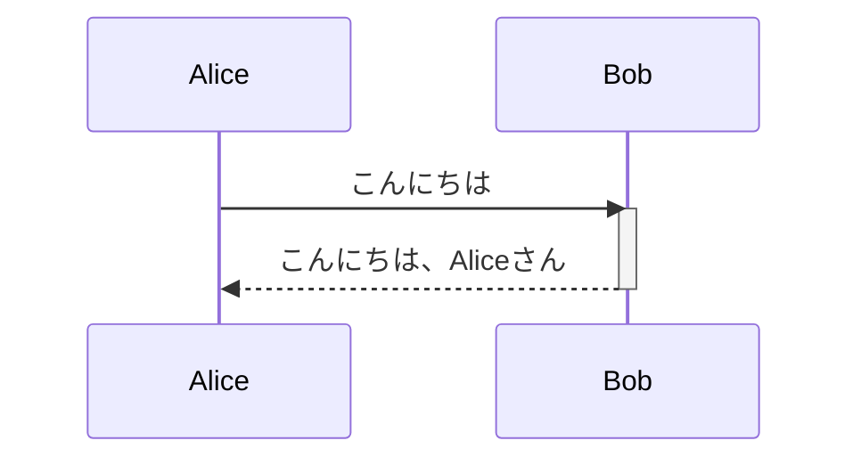

## 全体の設定

### タイトル

```
title タイトル
```

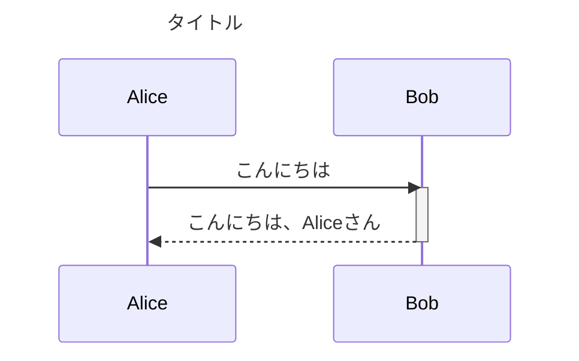

### ヘッダ

:::danger
mermaid.jsではヘッダはサポートされません。
:::

### フッタ

:::danger
mermaid.jsではフッタはサポートされません。
:::

### キャプション

:::danger
mermaid.jsではキャプションはサポートされません。
:::

### 下部エリア非表示

```
%%{init: { 'sequence': {'mirrorActors': false} } }%%
```

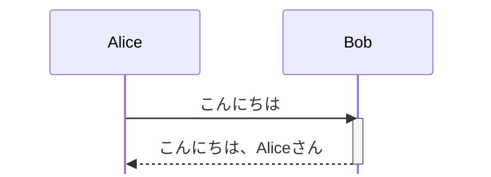

## 参加者

下記の様な参加者を指定できます。

### アクター

```
actor ユーザー
```


### バウンダリ

:::danger
mermaid.jsではシーケンス図でバウンダリを記載する事はできません。
:::

### コントロール

:::danger
mermaid.jsではシーケンス図でコントロールはサポートされません。
:::

### エンティティ

:::danger
mermaid.jsではシーケンス図でエンティティはサポートされません。
:::

### データベース

:::danger
mermaid.jsではシーケンス図でデータベースはサポートされません。
:::

### コレクション

:::danger
mermaid.jsではシーケンス図でコレクションはサポートされません。
:::

### 参加者

```
participant 参加者
```

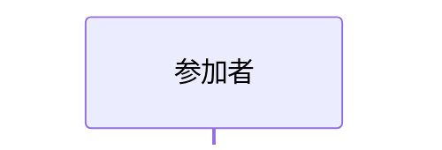

## メッセージ

### 同期メッセージ

```
ユーザー ->> コントロール : 同期メッセージ
```

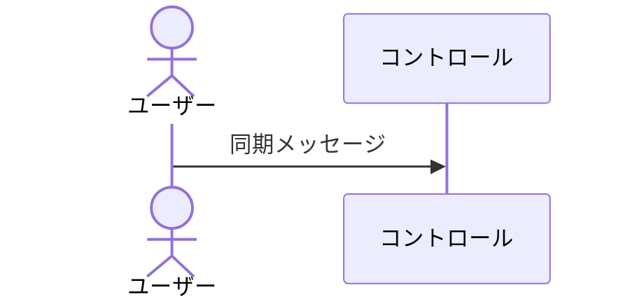

#### 同期メッセージを送り受信側を生成する場合

尚、破棄を記載しないと生成も表現されないみたいです。

```
ユーザー ->>+ コントロール : 同期メッセージ
```

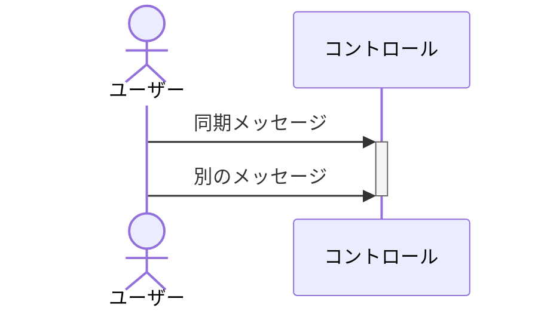

### 非同期メッセージ

```
ユーザー -) コントロール : 非同期メッセージ
```

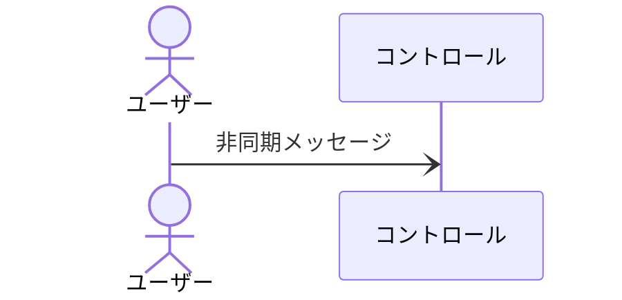

#### 非同期メッセージを送り受信側を生成する場合

尚、破棄を記載しないと生成も表現されないみたいです。

```
ユーザー -)+ コントロール : 非同期メッセージ
```

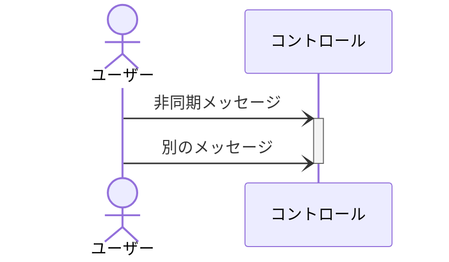

### リプライメッセージ

```
ユーザー -->> コントロール : リプライメッセージ
```

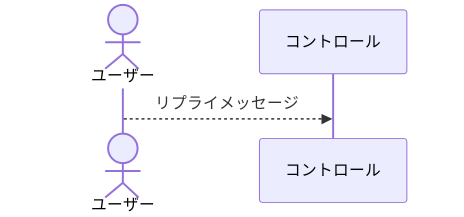

### 自分自身へメッセージ

```
ユーザー ->> ユーザー : 自分自身へメッセージ
```

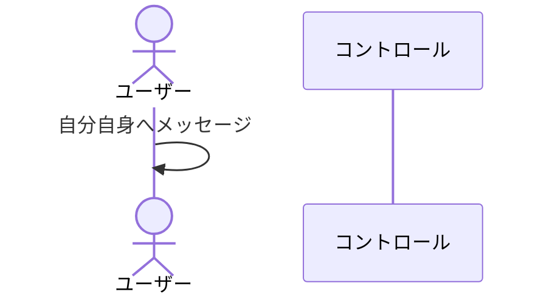

### 外部の要素へメッセージ

:::danger
mermaid.jsではシーケンス図で外部の要素へメッセージはサポートされません。
:::

### 外部の要素からメッセージ

:::danger
mermaid.jsではシーケンス図で外部の要素からメッセージはサポートされません。
:::

## 生成と破棄

:::danger
mermaid.jsではシーケンス図で生成と破棄はサポートされません。
:::

## アクティベーション

### 開始

```
ユーザー ->> コントロール : 生成メッセージ
activate コントロール
```

### 終了

```
コントロール -->> ユーザー : 破棄メッセージ
deactivate コントロール
```

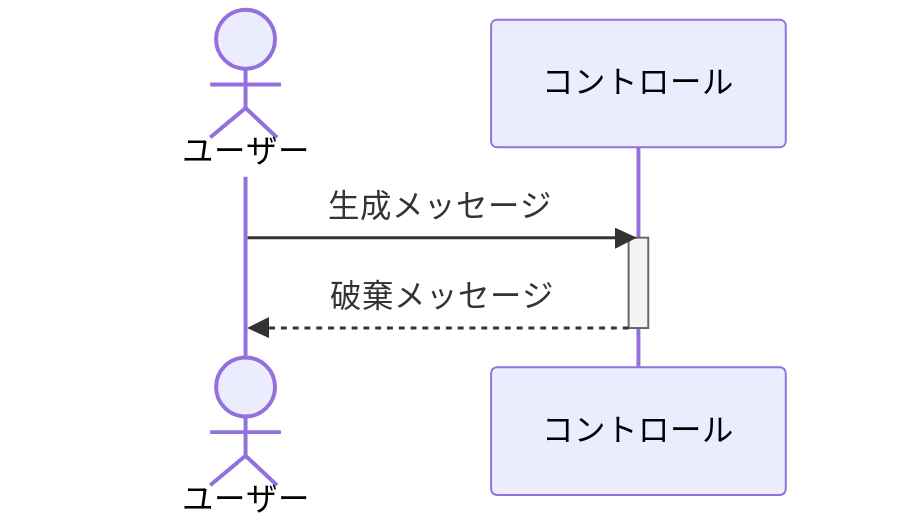

## フラグメント

### 条件分岐

#### どれか一つを必須で実行するような場合

```
alt x > 0
    ユーザー ->> コントロール : メッセージ１
else
    ユーザー ->> コントロール : メッセージ２
end
```

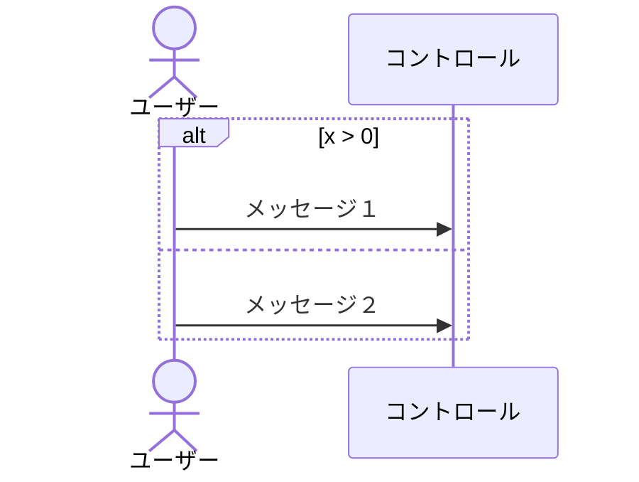

#### オプショナルなものの場合

```
opt x > 0
    ユーザー ->> コントロール : メッセージ１
end
```

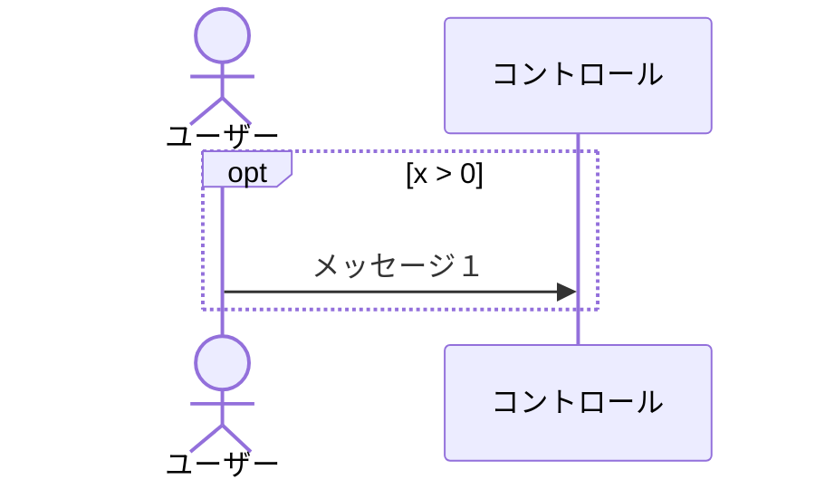

### 繰り返し

#### 繰り返し数を指定する場合

```
loop 記事数
    ユーザー ->> コントロール : メッセージ１
end
```

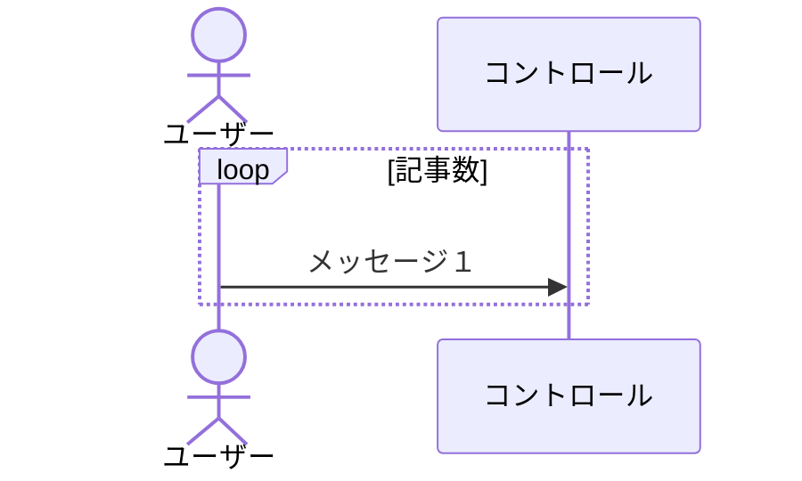

#### 最小値、最大値を指定する場合

```
loop 1, 10
    ユーザー ->> コントロール : メッセージ１
end
```

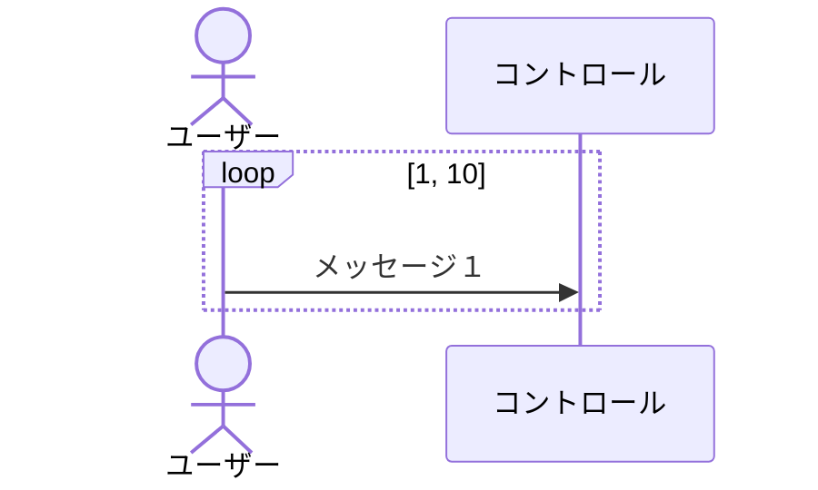

#### 無限ループの場合

```
loop
    ユーザー ->> コントロール : メッセージ１
end
```


### 処理中断

```
break 条件
    ユーザー ->> コントロール : メッセージ１
end
```

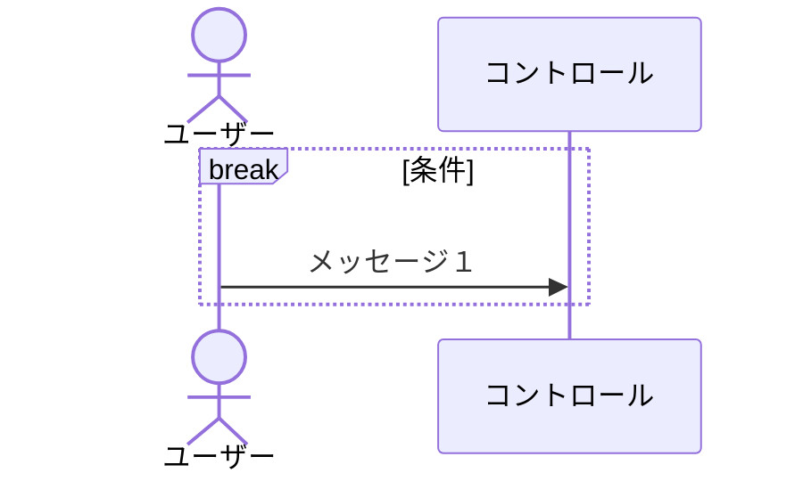

### 並列処理

```
par
    ユーザー ->> コントロール : メッセージ１
end
```

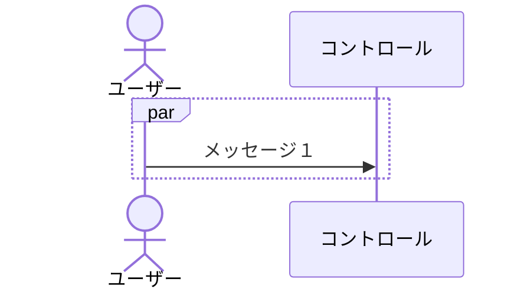

### クリティカル

```
critical
    ユーザー ->> コントロール : メッセージ１
end
```

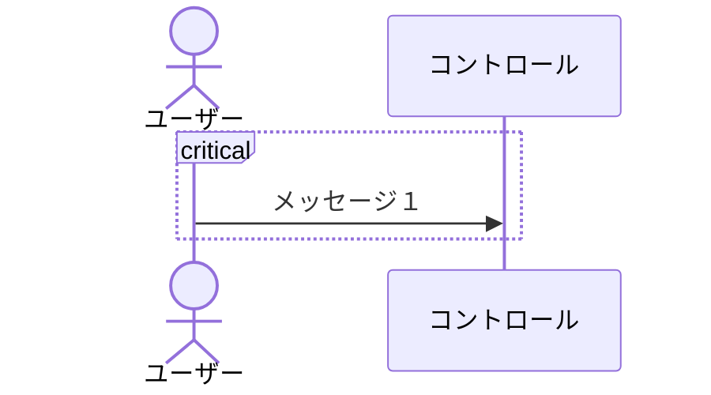

### シーケンス図の参照

:::danger
mermaid.jsではシーケンス図でシーケンス図の参照はサポートされません。
:::

### 遅延

:::danger
mermaid.jsではシーケンス図で遅延はサポートされません。
:::

### インターバル

:::danger
mermaid.jsではシーケンス図でインターバルはサポートされません。
:::

## ノート

ノートを定義できます。

### 左側

```
Note left of コントロール:ノート
```

```mermaid
sequenceDiagram
    actor ユーザー
    participant コントロール
    ユーザー ->> コントロール : メッセージ１
    Note left of コントロール:ノート
```

### 右側

```
Note right of コントロール:ノート
```

```mermaid
sequenceDiagram
    actor ユーザー
    participant コントロール
    ユーザー ->> コントロール : メッセージ１
    Note right of コントロール:ノート
```

### 上側

:::danger
mermaid.jsではシーケンス図で上側のノートはサポートされません。
:::

### 下側

:::danger
mermaid.jsではシーケンス図で下側のノートはサポートされません。
:::

## 行コメント

`%% `から始まる行は行コメントとして扱われます。


## ブロックコメント

`%%{ `から`%%}`まではブロックコメントとして扱われます。

## 参照

[https://qiita.com/Yorozuya59/items/1b7599aa87434c9d586a](https://qiita.com/Yorozuya59/items/1b7599aa87434c9d586a)
